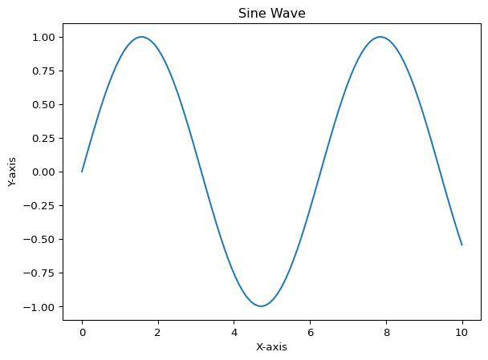

# Demonstrating Quarto for GitHub READMEs


## Section Header

You’ll want to make use of sections and subsections to organize your
document. Think of the sections as broad categories, and subsections as
more specific topics within those categories. I can make bigger
statements at this level.

### Subsection Header

Subsections are useful for breaking ideas down and adding details. This
is also likely where you’ll want to add code blocks.

It will be worth noting some chunk options that you might find useful.

If I want to hide code but show output, I can use `echo: false`.

    4

If I want to hide output but show code, I can use `results: 'hide'`.

``` python
2 + 2
```

    4

Maybe I want to show the code, but not run it. I can use `eval: false`.

``` python
2 + 2
```

In most of your chunks, you’ll probably want to turn off messages and
warnings. You might notice, though, that I did that globally in the
execute key in the header above. But if you want to do it in a specific
chunk, you can use:

## Loading Data and Models

If your project relies on heavy computations (either for the data prep
or modeling), you’ll probably want to show your work in a code chunk
that does not evaluate.

``` python
'''
Imagine that this is a long code block that reads data
and then starts your wrangling tasks. If it takes 
over a minute to run, you'll probably want to have
that work saved in a script and write your data out
to a file.
'''
```

You can quietly load in your prepped data in another chunk.

The same holds true for models, especially if you’re fitting complex
models that take

## Rendering Outputs

When I render this document, the output will be ready to appear as the
`readme` on my GitHub repository. Let’s see how that might look with
some plots and tables.

Notice below that I’m not going to print my code, I just want it to run.

Let’s see what a simple plot looks like.

``` python
data = {
    'x': np.linspace(0, 10, 100),
    'y': np.sin(np.linspace(0, 10, 100))
}

df = pd.DataFrame(data)

sns.lineplot(data=df, x='x', y='y')
plt.title('Sine Wave')
plt.xlabel('X-axis')
plt.ylabel('Y-axis')
plt.show()
```



This is where I am going to offer some explanations about the sine wave
above.

Now let’s see what a table looks like.

``` python
data_table = {
    'A': [1, 2, 3, 4, 5],
    'B': ['a', 'b', 'c', 'd', 'e'],
    'C': [10.5, 20.3, 30.2, 40.1, 50.0]
}
df_table = pd.DataFrame(data_table)
df_table.head().to_markdown()
```

    '|    |   A | B   |    C |\n|---:|----:|:----|-----:|\n|  0 |   1 | a   | 10.5 |\n|  1 |   2 | b   | 20.3 |\n|  2 |   3 | c   | 30.2 |\n|  3 |   4 | d   | 40.1 |\n|  4 |   5 | e   | 50   |'

Notice the use of `to_markdown()` to render the table nicely in GitHub’s
markdown format. It is a small thing that will make a big in difference
in how your document looks!

Now, let’s see what some linear model output looks like.

``` python
import statsmodels.api as sm    
X = df[['x']]
y = df['y']
X = sm.add_constant(X) 
model = sm.OLS(y, X).fit()
summary_table = model.summary().tables[1] 
print(summary_table)
```

    ==============================================================================
                     coef    std err          t      P>|t|      [0.025      0.975]
    ------------------------------------------------------------------------------
    const          0.2657      0.133      1.999      0.048       0.002       0.529
    x             -0.0173      0.023     -0.753      0.453      -0.063       0.028
    ==============================================================================

Notice how I indexed into the summary table object to just get the
coefficients table?

You migth want to talk about your coefficients and there are two ways
that you can do that:

1.  Manually type out your interpretations below the table.
2.  Use code to extract the coefficients and generate text
    automatically.

Option number 1, while more straightforward, is not the choice. Option
number 2 is more dynamic and reproducible, especially if you plan to
update your model or data in the future.

``` python
params = model.params
intercept = params['const']
slope = params['x'] 
```

Now that those are out, I can use inline chunks to reference them in my
text. You can think of inline chunks a lot like f-strings.

The intercept of the model is 0.266 and the slope is -0.017. No matter
what I do with my data or model, these values will always be up to date
in my text!

I can also pull out model fit statistics like *R*-squared. The
*R*-squared for this model is 0.006.

You have the full power of markdown and Python at your disposal. I just
want to show you some handy markdown things that you might want to use.

I can create **bold** text or *italicized* text.

Functions and variables can be represented in `monospace`. Note that
those are backticks, not apostrophes.

You can create bullet point lists:

- Item 1
- Item 2
  - Subitem 2a
  - Subitem 2b

You might want to include links within your document. You can use html
links like this: <a href="https://www.example.com">Example</a> or
markdown links like this: [Example](https://www.example.com).
